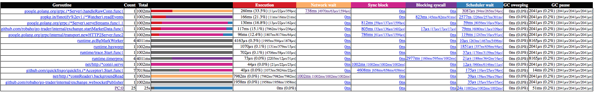

**Summary**

This project enhances the Go tracing facilities web interface.

It changes the 'go routine analysis' summary page to show detailed metrics, allows sorting, and one-click access to the analysis graphs.

The advanced metrics also includes basic min/avg/max times for each event within the category, rather than
just reporting the total time. This is extremely important for latency and performance analysis.

It is expected that these changes would be incorporated into the base distribution of Go, via issue [#29103](https://github.com/golang/go/issues/29103)

Here is the old page:

And thew new:

